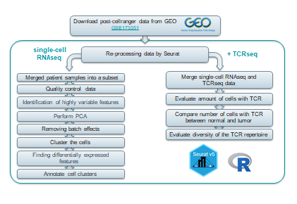
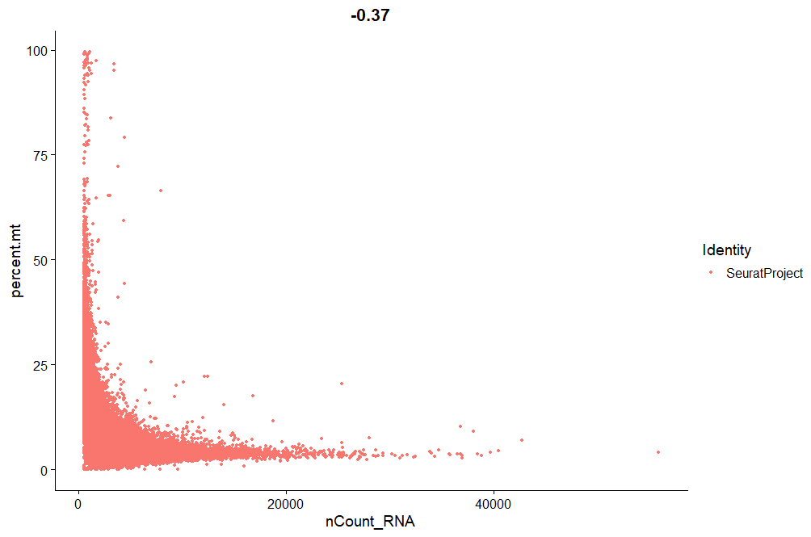
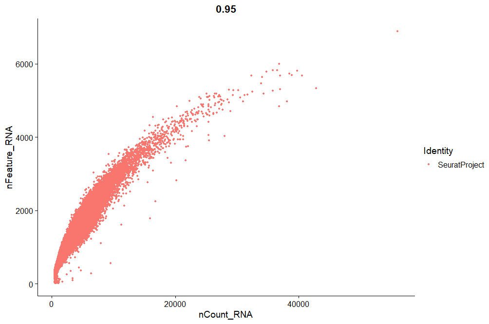
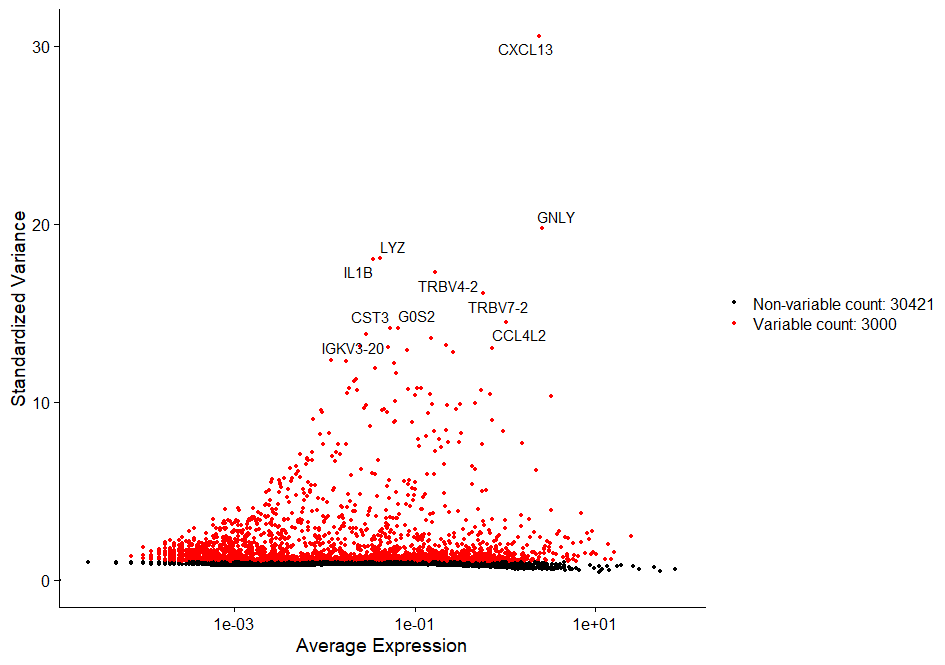
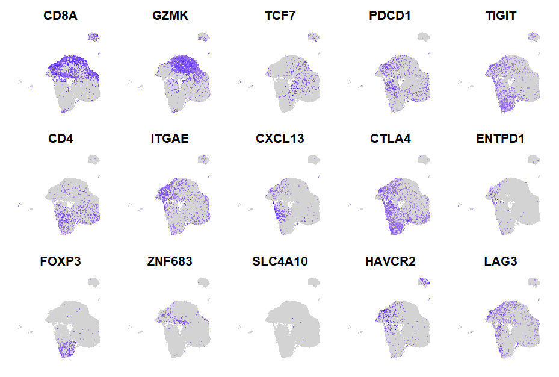
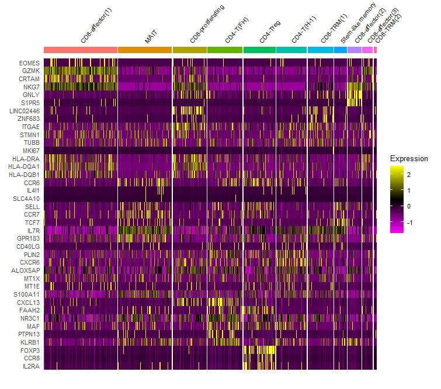
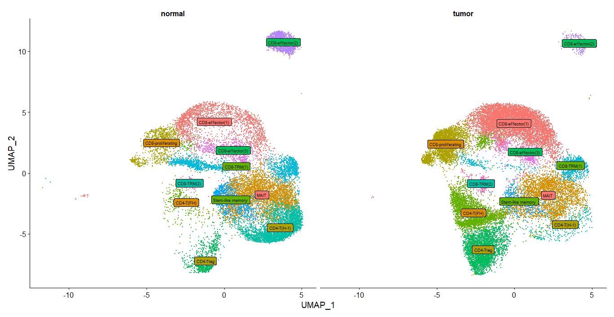
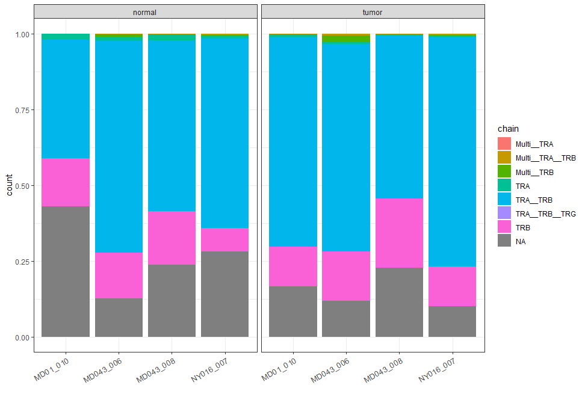
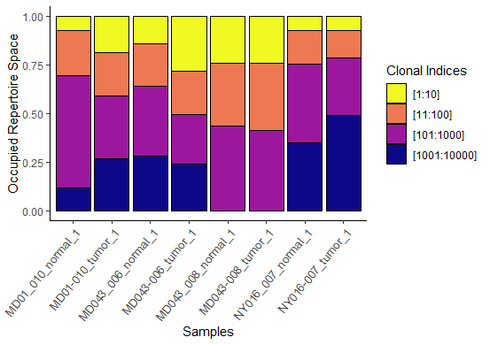
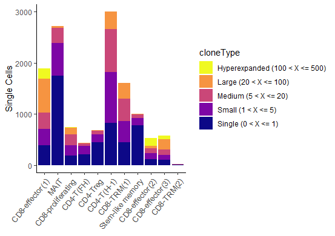

# Re-analysis of the public dataset: comparison and evaluation of T cells in paired tumor and normal lung single cell samples

Authors:
- Kseniia Dracheva
- Fedor Grigoryev

Supervisor:
- Ekaterina Esaulova

## Introduction
Due to numerous mutations in the tumor genome, the neoplasm expresses mutation-associated neoantigens (MANA) that can trigger an immune response against cancer in patients.
However, as the tumor evolves, malignant cells often acquire the ability to evade the immune response by expressing checkpoint proteins. 
Immunotherapy using antibodies against these checkpoints has been developed, but a significant number of patients do not respond to this treatment.
Biomarkers, such as the expression of checkpoint proteins, tumor mutational load, and neoantigenic load, are used to determine the suitability of immunotherapy.
These biomarkers are particularly relevant for highly mutated cancers like melanoma and lung cancer. 
Additionally, various metrics that assess the immunogenic qualities of neoantigens and tumor clonality are considered.
However, these biomarkers are not comprehensive, highlighting the need for further research on the immune component of tumors and also dysfunctional programs in
MANA specific tumor-infiltrating lymphocytes (TILs).

## Aim and objectives

**Aim** of this work is re-processing and replication of the analysis for published single-cell RNAseq and matched TCRseq data:
T cells from normal and cancerous tissues from multiple donors.

**Objectives:**
- Obtain post-cellranger data from GEO
- Perform QC, including identification of mitochondrial gene content, UMI content to filter out dead/damaged cells
- Filter genes for the downstream analysis to remove noise: removed Ig, TCR genes and IFN response genes
- Identify and annotate T cells clusters by the expression of marker genes of these subsets
- Evaluate amount of cells with TCR and compare repertoires between normal and tumor matched samples  
- Evaluate diversity of the TCR repertoire.

## Workflow

Our project is based on open data from the article “Transcriptional programs of neoantigen-specific TIL in anti-PD-1-treated lung cancers” (Caushi J. X. et al., 2021).
The data was obtained from GEO (GSE173351) and contains Cell Ranger (v3.1.0) output - digital gene expression matrix and TCR data for each sample.

The workflow of the project presented below:

The work was performed on R (version 4.2.3). The following R packages were used:

cRepertoire_1.8.0, data.table_1.14.8,  xlsx_0.6.5,     harmony_0.1.1,
Rcpp_1.0.10,        rjson_0.2.21,       ,gridExtra_2.3,  cowplot_1.1.1,
ggplot2_3.4.2,      dplyr_1.1.2,        tidyr_1.3.0,    SeuratObject_4.1.3, Seurat_4.3.0. 

The code presented in the files:
- clustering.R
- TCR.R

Due to computational limitations, we worked with a subset of patient samples from the article: 4 normal samples and 4 tumor samples.

## Results

**Clustering and annotation**

Patient samples were merged into a subset for following analysis. The quality of cells was then assessed based on:
1. the number of genes detected per cell, 
2. the proportion of mitochondrial gene. 

Low-quality cells were filtered if the number of detected genes was below 250 or above 2500, the proportion of mitochondrial gene counts was higher than 10%.
Also mitochondrial genes, genes associated with poorly supported transcriptional patterns were also removed from the analysis.

|Correlation plot nCount and percent.mt | Correlation plot nCount and nFeature |
| ------------- | ------------- |
|  |   |

Seurat (Hao Y., et al., 2022) was used to normalize the raw count data, identify highly variable features, scale features, and integrate samples. 
PCA was performed based on the 3,000 most variable features identified using the vst method implemented in Seurat.
Gene features associated with type I Interferon (IFN) response, immunoglobulin genes and TCR genes were excluded from clustering  to make sure that clustering result will not be influenced by their variability (Li H., et al. 2019).

The most variable features are presented in the figure below:

A batch effect was observed when merging several datasets. To eliminate it, we used the harmony method.                                                                      

| Clustering by patient before removing batch effects | Clustering by patient after removing batch effects |
| ------------- | ------------- |
|  |  |

Then the cells were grouped into clusters.
Cluster-specific genes were identified from the differential gene expression data, as well as cell-specific markers, which allowed them to be annotated.

Clustering by subset of marker genes is shown in the figure below:

Relative expression of the most differentially expressed genes according to the original article.  Five thousand cells were randomly selected from each cluster for imaging:

We identified clusters of major T-cell populations consistent with original publication: multiple CD8 cytotoxic, memory-like, proliferating clusters, MAIT T cells and multiple CD4 T
cell helper clusters. Tumor samples were enriched in cytotoxic CD8 cells, while normal samples were enriched in CD4 helper cells.  A cluster of CD8+ memory cells is also detected in
normal samples. 

Compared to the original article, we had lower resolution and obtained fewer clusters. This inconsistency may be due to two factors: usage of incomplete dataset, and thus decrease in
the variation, or difference in the algorithms for the batch correction, variable gene detection and clustering. 

**TCR data analysis**

The filtered single-cell data were merged with TCR data. The distribution of the number of cells containing different types of TCR chains is shown in the figure below:

The clonal expansion of TILs and TCR diversity were evaluated by using the scRepertoire package (Borcherding N., Bormann N. L., 2020).

There was a difference in the proportion of top clones in different samples:

Evaluation of the number of cells in clusters assigned to specific frequency range showed an increase in the number of hyperexpanded in the CD8 cell clusters, in CD 4 cells, hyperexpansive clonotypes are not present, and the proportion of large clonotypes is lower:

## Conclusion

The T-cells were clustered and annotated into subgroups. Matched TCR sequencing has allowed for evaluation of clonal expansion with each T cell subtype and comparison between tumor and normal lung microenvironment. 

It would be of great interest to explore and compare transcriptional programs of tumor associated antigen specific clones in the subsequent works. 

## References

1. Caushi J. X., Zhang J., Ji, Z., et al. (2021). Transcriptional programs of neoantigen-specific TIL in anti-PD-1-treated lung cancers. Nature, 596(7870), 126-132. doi: 10.1038/s41586-021-03752-4
2. Hao Y., Stuart T., et al. (2022). Dictionary learning for integrative, multimodal, and scalable single-cell analysis. bioRxiv, 2022-02. doi: /10.1101/2022.02.24.481684 
3. Borcherding N., Bormann N. L. (2020). scRepertoire: An R-based toolkit for single-cell immune receptor analysis. F1000Research, 9. doi: 10.12688/f1000research.22139.2 
4. Li H., van der Leun A. M., et al. (2019). Dysfunctional CD8 T cells form a proliferative, dynamically regulated compartment within human melanoma. Cell, 176(4), 775-789. doi: 10.1016/j.cell.2018.11.043

