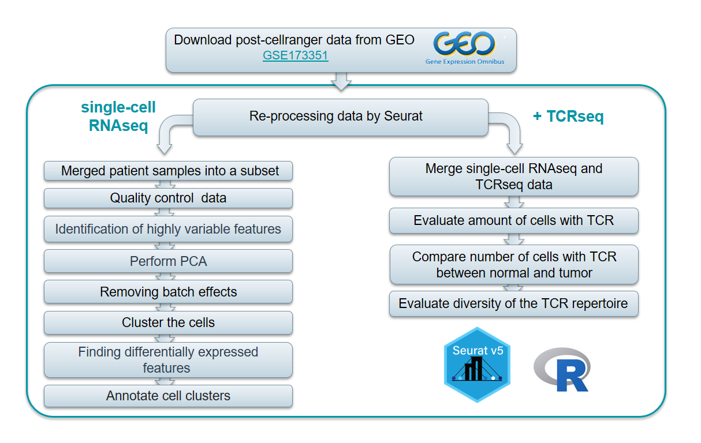

# Re-analysis of the public dataset: comparison and evaluation of T cells in paired tumor and normal lung single cell samples

Authors:
- Fedor Grigoryev
- Kseniia Dracheva

Supervisor:
- Ekaterina Esaulova

## Introduction
Due to numerous mutations in the tumor genome, the neoplasm expresses mutation-associated neoantigens (MANA) that can trigger an immune response against cancer in patients.
However, as the tumor evolves, malignant cells often acquire the ability to evade the immune response by expressing checkpoint proteins. 
Immunotherapy using antibodies against these checkpoints has been developed, but a significant number of patients do not respond to this treatment.
Biomarkers, such as the expression of checkpoint proteins, tumor mutational load, and neoantigenic load, are used to determine the suitability of immunotherapy.
These biomarkers are particularly relevant for highly mutated cancers like melanoma and lung cancer. 
Additionally, various metrics that assess the immunogenic qualities of neoantigens and tumor clonality are considered.
However, these biomarkers are not comprehensive, highlighting the need for further research on the immune component of tumors and also dysfunctional programs in
MANA specific tumor-infiltrating lymphocytes (TILs).

## Aim and objectives

**Aim** of this work is re-processing and replication of the analysis for published single-cell RNAseq and matched TCRseq data:
T cells from normal and cancerous tissues from multiple donors.

**Objectives:**
- Obtain post-cellranger data from GEO
- Perform QC, including identification of mitochondrial gene content, UMI content to filter out dead/damaged cells
- Filter genes for the downstream analysis to remove noise: removed Ig, TCR genes and IFN response genes
- Identify and annotate T cells clusters by the expression of marker genes of these subsets
- Evaluate amount of cells with TCR and compare repertoires between normal and tumor matched samples  
- Evaluate diversity of the TCR repertoire.

## Workflow

The workflow of the project presented below:

The work was performed on R (version 4.2.3). The following R packages were used:

cRepertoire_1.8.0, data.table_1.14.8,  xlsx_0.6.5,     harmony_0.1.1,
Rcpp_1.0.10,        rjson_0.2.21,       ,gridExtra_2.3,  cowplot_1.1.1,
ggplot2_3.4.2,      dplyr_1.1.2,        tidyr_1.3.0,    SeuratObject_4.1.3, Seurat_4.3.0. 

The code presented in the files:
- clustering.R
- TCR.R

Due to computational limitations, we worked with a subset of patient samples from the article: 4 normal samples and 4 tumor samples.

